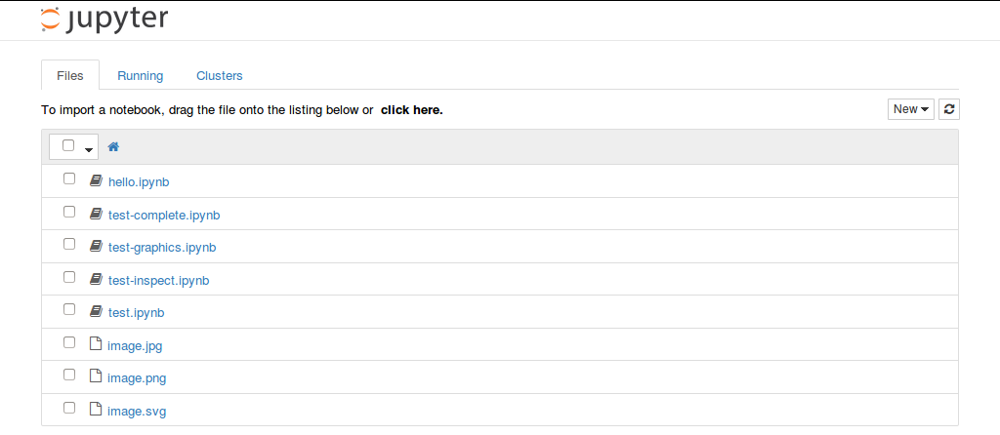

# IJavascript: A Javascript Kernel for IPython's Graphical Notebook

IJavascript is an [`npm` package](https://www.npmjs.com/) that implements a
Javascript kernel for [IPython's graphical
notebook](http://ipython.org/notebook.html) (also known as
[Jupyter](http://jupyter.org/)). An IPython notebook combines the creation of
rich-text documents (including equations, plots and videos) with the execution
of code in a number of programming languages.

The execution of code is carried out by means of a kernel that implements the
[IPython messaging
protocol](http://ipython.org/ipython-doc/stable/development/messaging.html).
There are kernels available for [Python](http://ipython.org/notebook.html),
[Julia](https://github.com/JuliaLang/IJulia.jl),
[Ruby](https://github.com/minad/iruby),
[Haskell](https://github.com/gibiansky/IHaskell) and [many
others](https://github.com/ipython/ipython/wiki/IPython-kernels-for-other-languages).

IJavascript implements the latest stable specification of the protocol, [version
4.1](http://ipython.org/ipython-doc/stable/development/messaging.html).  This
specification will be updated to [version
5.0](http://ipython.org/ipython-doc/dev/development/messaging.html) in the
next release of IPython.

A repository of IPython notebooks can be found
[here](http://nbviewer.ipython.org/).

## Prerequisites

The prerequisites vary from platform to platform.

### Debian and Ubuntu
In recent Debian and Ubuntu distributions, it's enough to run the following
command:

```sh
sudo apt-get install nodejs-legacy npm ipython ipython-notebook libzmq-dev
```

#### Ubuntu 12.04

In Ubuntu 12.04, both `node.js` and `ipython` need upgrading to a recent
version:

```sh
sudo apt-get install libzmq-dev python-dev python-pip g++ curl
curl -sL https://deb.nodesource.com/setup | sudo bash -
sudo apt-get install -y nodejs
sudo pip install --upgrade ipython jinja2 tornado jsonschema pyzmq
```

The instructions for upgrading `node.js` have been adapted from those found
[here](https://github.com/joyent/node/wiki/Installing-Node.js-via-package-manager#debian-and-ubuntu-based-linux-distributions).

### Other Platforms

For other platforms, instructions may be found at
[nodejs.org/download](http://nodejs.org/download/),
[ipython.org/install](http://ipython.org/install.html) and
[zeromq.org/intro:get-the-software](http://zeromq.org/intro:get-the-software).

## Installation

To install IJavascript globally (i.e. for all users in the system), run:

```sh
sudo npm install -g ijavascript
```

To install locally, run:

```sh
npm install ijavascript
```

In Debian and Ubuntu distributions, the above command will install the
executable `ijs` in the folder `~/node_modules/.bin/`. You may want to add this
folder to your PATH:

```sh
echo \"PATH=\"\$HOME/node_modules/.bin\" >> ~/.profile
```

Note that the above change won't take effect until you log out of the current
session.

## Usage

To start an IPython notebook session with the Javascript kernel, simply run:

```sh
ijs
```

This command should open the IPython notebook dashboard in your default web
browser:


By default, the dashboard opens the notebooks in the current working folder. The
flag `--notebook-dir=path/to/another/folder` can be used to open the dashboard
at a different folder:

```sh
ijs --notebook-dir=path/to/another/folder
```



Here's a sample notebook that makes use of the Javascript kernel:


Documentation on other flags, can be found using IPython's notebook help:

```sh
ipython notebook help
```

## TO DO

- Add tests
- Complete the implementation of IPython's messaging protocol v4.1
- Implement Jupyter's messaging protocol v5.0
- Provide graphical output
