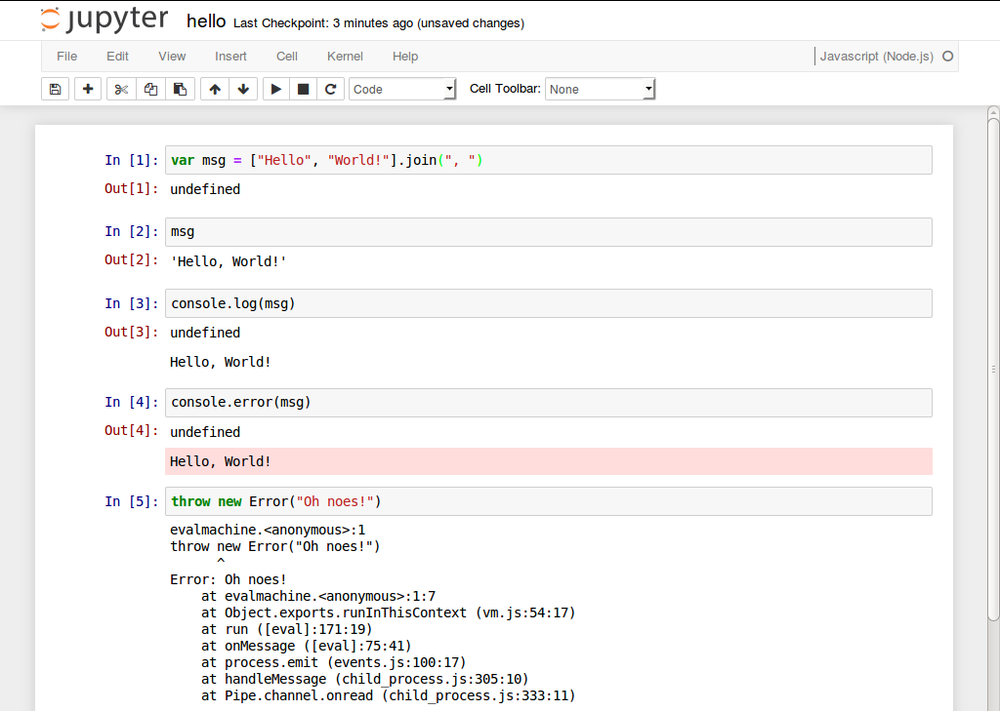

# IJavascript: A Javascript Kernel for IPython's Graphical Notebook

IJavascript is an [`npm` package](https://www.npmjs.com/) that implements a
Javascript kernel for [IPython's graphical
notebook](http://ipython.org/notebook.html) (also known as
[Jupyter](http://jupyter.org/)). An IPython notebook combines the creation of
rich-text documents (including equations, plots and videos) with the execution
of code in a number of programming languages.

The execution of code is carried out by means of a kernel that implements the
[IPython messaging
protocol](http://ipython.org/ipython-doc/stable/development/messaging.html).
There are kernels available for [Python](http://ipython.org/notebook.html),
[Julia](https://github.com/JuliaLang/IJulia.jl),
[Ruby](https://github.com/minad/iruby),
[Haskell](https://github.com/gibiansky/IHaskell) and [many
other languages](https://github.com/ipython/ipython/wiki/IPython-kernels-for-other-languages).

## Main Features

- Run Javascript code within a `node.js` session
- [Autocompletion](http://n-riesco.github.io/ijavascript/tutorial-complete.html): press `TAB` to complete keywords and object
  properties
- [Object inspection](http://n-riesco.github.io/ijavascript/tutorial-inspect.html): press `Shift-TAB` to inspect an object
  and show its content or, if available, its documentation
- [Graphical output](http://n-riesco.github.io/ijavascript/tutorial-graphics.html) for `HTML`, `PNG`, ...

## Installation

The instructions to install IJavascript are platform-dependent. For example, in
Ubuntu 14.04, IJavascript and its prerequisites can be installed simply by
running:

```sh
sudo apt-get install nodejs-legacy npm ipython ipython-notebook libzmq-dev
sudo npm install -g ijavascript
```

For other platforms, please, refer to the [installation notes](http://n-riesco.github.io/ijavascript/tutorial-install.html).

## Usage

To start an IPython notebook session with the IJavascript kernel, run:

```sh
ijs
```

This command should open the IPython notebook dashboard in your default web
browser:


Here's a sample notebook that makes use of the IJavascript kernel:



Please, refer to the [usage notes](http://n-riesco.github.io/ijavascript/tutorial-usage.html) for further details.

## Documentation

You can build the documentation for this package with the command `make jsdoc`.
To run this command you'll need to install ipython on your system as it uses
nb convert to convert ipython notebooks to html files.

Currently, the documentation is hosted on the gh-pages branch on github, you can
view it here: <http://n-riesco.github.io/ijavascript/tutorial-graphics.html>

To publish the doc you'll need the python tool [ghp-import](https://pypi.python.org/pypi/ghp-import/0.4.1),
and type `make publish-doc`


# Contributions

First of all, thank you for taking the time to contribute. Please, read
[CONTRIBUTING.md](CONTRIBUTING.md) and use the
[issue tracker](https://github.com/n-riesco/ijavascript/issues) for any
contributions: support requests, bug reports, enhancement requests, pull
requests, ...

# TO DO

- Add tests
- Complete the implementation of IPython's messaging protocol v4.1
- Complete the implementation of IPython's messaging protocol v5.0
- Add tutorials
